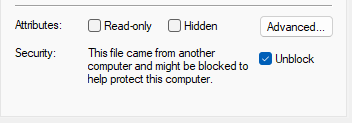

# Optimal Coverage

Advanced path planning plugin for ArduPilot's [Mission Planner](https://ardupilot.org/planner/). Uses a web API built around [Fields2Cover](https://fields2cover.github.io/). Many thanks to @Gonzalo-Mier for his work on the Fields2Cover project. See [this paper](https://ieeexplore.ieee.org/document/10050562) for technical background.

[LICENSE](https://github.com/ArduPilot/MissionPlanner/blob/master/COPYING.txt)

## Installation

> *NOTE: This plugin requires an external API server to function. See https://github.com/yuri-rage/f2c-rest-api. If using a locally hosted API instance in WSL2, a WSL terminal window may need to remain open while using the plugin.*  *This requirement may be alleviated in future releases if the API is hosted on a commercial server.*

- Copy the latest `OptimalCoverage.dll` from [Releases](https://github.com/yuri-rage/mission-planner-optimal-coverage/releases) to your Mission Planner installation directory.
	- Typically `C:\Program Files (x86)\Mission Planner\plugins\`
- Windows may automatically block the unsigned library file. To unblock it, right click the filename in Windows Explorer and select "Properties." Then check "Unblock" and click "Ok."

   

- Restart Mission Planner if it was already open.

## Usage

- Open Mission Planner's "PLAN" tab and draw a polygon as you would for use with the "Survey Grid" feature(s).
   - Optionally, create fences around obstacles/avoid areas if they are not already uploaded to a connected vehicle.
- Right click on the map, and select "Auto WP -> Optimal Coverage."
- The first time the options dialog opens, click "Refresh API Connection."
   - Enter the API URL or IP address. If using a local WSL2 installation, use the loopback address: `127.0.0.1`
   - Enter the API port (`8087` per the example on the [API homepage](https://github.com/yuri-rage/f2c-rest-api))
- Configure the following options and click "Accept" when finished:

### General Options:

- **Swath Width:** Width between coverage swaths (rows/lanes). For mowing, this is mower deck width minus some margin for overlap. For aerial photography, this is camera FOV width minus some margin for overlap.
- **Margin:** Margin (headland) within the polygon and around fences. Increase this for more turning room.
- **Altitude**: Altitude at which the mission will be planned. Any value is valid for Rovers.
- **Start Point:** Each plan has 2-4 possible variations. Increment the start point to move it around the field.
- **Arc Segment Length:** This is the target distance between waypoints when converting circular exclusion fences to segmented polygons. Smaller values yield better resolution but potentially longer processing time. 0.5 - 1.0m should be adequate for most applications.
- **Min Turn Radius:** Enter the minimum turn radius for your machine. 0.0 is valid for skid-steered vehicles or Copters. Larger values will result in more waypoints between rows and could violate the polygon perimeter (use Margin to compensate).
- **Min WP Distance:** Consecutive waypoints less than this distance apart will be removed. Recommend keeping this greater than zero, or the path planner will return "smoothed" results with high waypoint counts.
- **Decompose Angle:** When using the advanced route planner, if this value is greater than zero, fields will be subdivided along this azimuth before route generation. Most useful in "L" shaped fields where the decomposition angle is set parallel to one leg of the "L." See [cell decomposition](https://fields2cover.github.io/source/tutorials/decomposition.html).

### Swath Generation

- **Fewest Swaths:** This option is usually optimal and should result in the longest continuous path segments and fewest turns.
- **Shortest Swath Length:** Swaths are optimized in the shortest direction across the field.
- **Fixed Orientation:** Swaths are generated across the field in this direction (direction of travel will be ~90 degrees to the specified angle).
- **Plan around fences:** Use exclusion fence geometry when planning paths.

### Route Generation

- **Advanced Route Planner:** Plans a near optimal raster-type pattern across the field, given the constraints from the swath generator. Typically avoids all fences very well.
- **Simple (Boustrophedon):** Sorts swaths in a raster-type pattern. May not avoid all fences cleanly.
- **Snake Order:** Skip row pattern. Useful when turn radius is greater than swath width. May not avoid all fences cleanly.
- **Spiral Order:** Groups of snake ordered (skip row) swaths, grouped by the value indicated to the right of the radio button. See [spiral order](https://fields2cover.github.io/source/tutorials/route_planning.html#spiral-order).

> *NOTE: If not connected to a vehicle, fences will disppear from view when switching back to "MISSION" planning mode. Edited fences will remain in memory for use with the Fence Replanner despite not being shown on screen.*

## Known Issues

- Exclusion fences may not always be honored, particularly if using a method other than "Advanced Route Planner."
- Using a large turn radius may cause the planned path to exceed the boundary of the drawn polygon.
- Small values for min waypoint distance and arc segment length may result in large data size and/or large waypoint counts. No constraint is placed on mission size.
